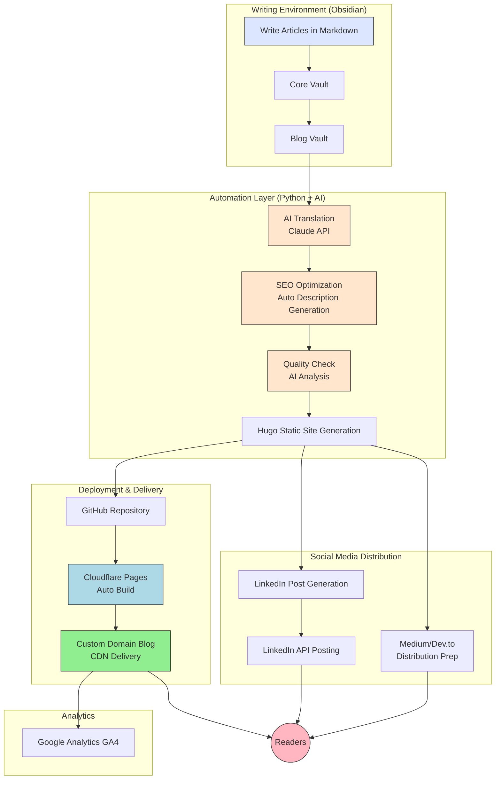

## Introduction: Why I Built This System

For 9 years since joining the company, I've worked as an engineer in the AD/ADAS field. While I accumulated expertise, I felt it was a career risk that my work wasn't visible outside the company and had zero recognition in the global market.

**Expertise might as well not exist if it isn't visible.**

Then I realized: **Nothing will change unless I put myself out there.**

However, I faced the following challenges:

- **Lack of time**: With a full-time job, I couldn't dedicate 10 hours per week to blogging
- **Difficulty maintaining**: Manual posting is cumbersome and leads to quick abandonment
- **Global reach**: Japanese-only content has limitations; English content is also necessary

In this article, I'll introduce the **bilingual automated blog posting system I built that costs only $10.18 per year** to operate.

---

## What This System Can Achieve

### Key Features

Write article (Obsidian) → One button → Distribute worldwide

Specifically:
- Write in Japanese → Auto-generate English version via AI translation
- Automatic SEO optimization
- Auto-publish to custom domain blog
- Auto-generate LinkedIn posts
- Prepare for distribution to Medium, Dev.to, etc.
- Automatic Google Analytics tracking

Time required: Within 5 minutes (excluding article writing)
Annual cost: $10.18 (domain fee only)

### Challenges Solved

#### Before (Pre-System Build)

3 hours to publish one article:
- Writing in Obsidian: 2 hours
- Manual HTML conversion: 20 minutes
- Image optimization: 15 minutes
- SEO configuration: 15 minutes
- GitHub push: 10 minutes
- Deploy verification: 10 minutes
- LinkedIn post creation: 30 minutes
- English translation: 1 hour (outsourced or self-translated)

**Total: 4-5 hours**
→ Impossible to publish 2 articles per week
→ Gave up

#### After (Post-System Build)

1 hour to publish one article:
- Writing in Obsidian: 50 minutes
- Run automation script: 5 minutes
  → AI translation
  → SEO optimization
  → Image optimization
  → Automatic GitHub push
  → Automatic Cloudflare deployment
  → Auto-generate LinkedIn post
- Final check: 5 minutes

**Total: 1 hour**
→ Possible to publish 2 articles per week
→ Sustainable

---

## System Architecture

### Overall System Diagram



---

### Technology Stack

| Category | Technology | Role | Cost |
|----------|------------|------|------|
| **Writing** | Obsidian | Markdown article creation, knowledge production core | Free |
| **SSG** | Hugo | Static site generation (Markdown→HTML) | Free |
| **AI** | Claude API | Translation, quality check, SEO optimization | $5-10/month |
| **Hosting** | Cloudflare Pages | Auto deployment & CDN delivery | Free |
| **Version Control** | GitHub | Source control & CI/CD | Free |
| **Domain** | NameCheap | Custom domain | $10.18/year ✅ |
| **DNS** | Cloudflare | DNS management & email forwarding | Free |
| **SNS API** | LinkedIn API | Auto posting | Free |
| **Analytics** | Google Analytics | Access tracking | Free |

**Total Annual Cost: $10.18 + API usage $60-120 = $70.18-130.18 (approximately ¥10,000)**

---

## Core Implementation: 5 Stages

### Stage 1: Draft

**Purpose**: Review and modify articles locally

```bash
draft.bat

# Or include English translation simultaneously
draft_translate.bat
```

**Process**:
1. Retrieve articles from Obsidian (Core Vault)
2. Automatically convert to Hugo format
3. Save with `draft: true` (private)
4. Auto-launch Hugo server
5. Open `http://localhost:1313` in browser

**At this stage**:
- No GitHub push
- Multiple revisions and previews possible
- Completely local process

**AI Translation Feature**:
```python
# translate_article.py (excerpt)
def translate_with_claude(japanese_text):
    """Translate Japanese to English using Claude API"""
    prompt = f"""
    Please translate the following technical article to English:
    - Use appropriate technical terms
    - Natural, readable English
    - Preserve Markdown formatting
    
    {japanese_text}
    """
    # Call Claude API
    response = call_claude_api(prompt)
    return response
```

### Stage 2: Quality Check

**Purpose**: Perform AI-based article quality analysis

```bash
check.bat
```

**Check Items**:
- Detection of omitted subjects (Japanese-specific issue)
- Detection of logical gaps
- Abstract-to-concrete correspondence
- Detection of ambiguous expressions
- Accuracy of technical terms
- SEO improvement suggestions

**Output Example**:

```markdown
# Quality Report

## Subject Omission (3 places)
- Line 45: "Built the system" → Who did?
  Suggestion: "I built the system"

## Logic Gaps (2 locations)
- Line 78-82: Gap between Step 2 and Step 3
  Suggestion: Add intermediate steps

## Ambiguous Expressions (5 locations)
- Line 92: "quite fast" → what are the specific numbers?
  Suggestion: "3 times faster (7h → 2h)"

## Overall Rating: 85/100
Can improve to: 90/100
```

### Stage 3: Pre-Publish Optimization

**Purpose**: Perform SEO optimization and Description auto-generation

```bash
# Automatically executed when publish.bat runs
```

**Execution Details**:

**1. Description Auto-generation (Claude API)**
```python
def generate_description(article_text):
    """Generate SEO-optimized summary automatically"""
    prompt = f"""
    Please generate an SEO-optimized summary from the following article.
    
    Requirements:
    - 120-160 characters
    - Naturally include keywords
    - Capture reader interest
    - Convey article core message
    
    {article_text}
    """
    description = call_claude_api(prompt)
    return description
```

**2. Automated SEO Check**
```python
seo_checks = {
    'title_length': Within 60 characters?,
    'h1_exists': Has H1 tag?,
    'description': Between 120-160 characters?,
    'images': Has alt attributes?,
    'word_count': Minimum 1,500 words?,
    'tags': Has 3-5 tags?,
    'internal_links': Has internal links?
}
```

**3. H1 Handling (Important)**
```markdown
Issue: Hugo theme outputs title as H1
     → Duplicates with H1 in Markdown
     → Bad for SEO

Solution: 
1. Comment out H1 in Markdown
2. Hide with CSS
3. Keep in HTML (for SEO)
```

### Stage 4: Publish

**Purpose**: Actually publish the article

```bash
publish.bat
```

**Execution Flow**:
```python
def publish_workflow():
    # 1. Generate description
    description = generate_description(article)
    
    # 2. SEO automatic check
    seo_result = check_seo(article)
    if not seo_result.passed:
        print("SEO issues found:", seo_result.issues)
        if not confirm("Publish anyway?"):
            return
    
    # 3. Convert to Hugo format (draft: false)
    convert_to_hugo(article, draft=False)
    
    # 4. Save Japanese and English versions
    save_bilingual_articles(article_ja, article_en)
    
    # 5. Automatic Git push
    git_push_with_message(f"Publish: {article.title}")
    
    # 6. Generate LinkedIn posts
    generate_linkedin_posts(article)
    
    print("✅ Publishing complete!")
    print(f"Japanese: https://takuyaniioka.com/ja/posts/{slug}/")
    print(f"English: https://takuyaniioka.com/posts/{slug}/")
```

**Post-publish Auto-deployment**:
```
GitHub Push
    ↓ (Webhook)
Cloudflare Pages Detection
    ↓
Hugo Auto-build (about 30 seconds)
    ↓
CDN Distribution
    ↓
Blog Published
```

### Stage 5: Social Media (LinkedIn)

**Purpose**: Automatically generate LinkedIn posts from articles

```bash
linkedin_post.bat
```

This system can automatically generate LinkedIn posts from articles. We plan to modify the design in the future to allow manual editing and posting as needed.

### Stage 6: Analytics

**Google Analytics GA4 Integration**:

```toml
# BlogVault/config.toml
[params]
  googleAnalytics = "G-XXXXXXXXXX"
```

**Tracking Data**:
- Real-time access
- Traffic sources (LinkedIn, Medium, Google etc.)
- Popular article rankings
- Device and region statistics
- Time on site and bounce rate

## Design Philosophy: Why This Architecture?

### 1. Obsidian-Centric Approach

**Reasons**:
- **Second Brain**: Core of my intellectual productivity
- **Unified Management**: Articles and notes, all managed in Obsidian
- **Prevent Thought Fragmentation**: Information is not scattered

**Structure**:
```
Obsidian/
├── Core Vault/          # Private & intellectual production
│   ├── Daily Notes/
│   ├── Projects/
│   └── Articles/        # Article drafts
│
└── Blog Vault/          # Public & blog-specific
    ├── content/
    ├── static/
    └── config.toml
```

**Reasons for Separation**:
- Core Vault is private (personal notes & confidential information)
- Blog Vault is public (pushed to GitHub)
- Maintains clear boundaries


### 2. AI Utilization Philosophy

**AI is "Augmentation" not "Replacement"**

```
[Wrong Usage]
Let AI write everything
→ Zero originality
→ Zero value

[Correct Usage]
Human: Write core insights & experiences
AI: Automate translation, SEO, quality checks

→ Humans focus on intellectual production
→ AI handles repetitive tasks
```

**Concrete Examples**:
- ✅ AI Translation: Think deeply in Japanese, AI translates to English
- ✅ SEO Optimization: AI auto-generates descriptions
- ✅ Quality Check: AI provides objective review
- ❌ Article Writing: Written by humans (AI assists only)


### 3. Staged Workflow

#### Why Split into 5 Stages:

**Reason 1: Safety**
- Gradual verification instead of immediate publication
- Detect and fix issues at each stage

**Reason 2: Flexibility**
- Can pause at any point
- Can resume from any stage

**Reason 3: Debuggability**
- Clear identification of where problems occur
- Logs provide immediate clarity

## Implementation Details: Core Features

### Feature 1: Article Format Conversion

**Challenge**:
- Obsidian format (EvolutionVault)
- Hugo format (BlogVault)
- Different formats

**Solution**:
```python
def convert_evolution_to_hugo_format(source_file, draft_mode=True):
    """EvolutionVault format → Hugo format"""
    
    # 1. Parse YAML frontmatter
    with open(source_file, 'r', encoding='utf-8') as f:
        content = f.read()
    
    # Separate frontmatter and body
    if content.startswith('---'):
        parts = content.split('---', 2)
        frontmatter = parts[1]
        body = parts[2] if len(parts) > 2 else ""
    
    # 2. Convert for Hugo
    hugo_frontmatter = convert_frontmatter(frontmatter)
    hugo_frontmatter['draft'] = draft_mode
    
    # 3. Save
    output_path = get_hugo_path(source_file)
    save_hugo_file(output_path, hugo_frontmatter, body)
```

### Feature 2: Automated SEO Optimization

**Challenge**:
- Manual description writing is time-consuming
- Easy to miss SEO checks

**Solution**:
```python
def optimize_seo(article):
    """Automated SEO optimization"""
    
    # 1. Auto-generate description (Claude API)
    description = generate_description_with_ai(article.content)
    article.description = description
    
    # 2. SEO checklist
    checks = [
        check_title_length(article.title),
        check_description_length(article.description),
        check_h1_tag(article.content),
        check_image_alt_tags(article.content),
        check_word_count(article.content),
        check_tags(article.tags),
        check_internal_links(article.content)
    ]
    
    # 3. Warning if issues found
    issues = [c for c in checks if not c.passed]
    if issues:
        print("⚠️ SEO issues:")
        for issue in issues:
            print(f"  - {issue.message}")
    
    return article
```

### Feature 3: Bilingual Support

**Challenge**:
- Managing Japanese and English separately is complex
- Separate URLs needed

**Solution**:
```
Utilizing Hugo's multilingual features:

Japanese:
https://takuyaniioka.com/ja/posts/article-slug/

English:
https://takuyaniioka.com/posts/article-slug/

Automatic switching:
- Detects browser language settings
- Japanese browser → /ja/
- English browser → /
```

**Implementation**:
```toml
# config.toml
[languages]
  [languages.en]
    languageName = "English"
    weight = 1
    contentDir = "content"
    
  [languages.ja]
    languageName = "日本語"
    weight = 2
    contentDir = "content"
    
[params]
  defaultContentLanguage = "en"
  defaultContentLanguageInSubdir = false
```

## Results: What This System Delivered

### Quantitative Results

| Metric                 | Before                                 | After                       | Improvement   |
| ---------------------- | -------------------------------------- | --------------------------- | ------------- |
| **Writing Efficiency** | 5 hours/article                        | 1 hour/article              | 5x faster     |
| **Weekly Posts**       | 0-1 posts                              | 2 posts                     | 2x+           |
| **Annual Articles**    | 10-20 (including dropouts)             | 60+ (achievable target)     | 3-6x          |
| **Cost**               | Outsourced translation $50-100/article | $10.18/year + API $10/month | 95% reduction |

## How to Build This System

### Construction Steps (Overview)

**Step 1: Environment Setup (1 hour)**
1. Install Obsidian
2. Install Hugo
3. Install Git
4. Install Python
5. Create GitHub account
6. Create Cloudflare account

**Step 2: Domain Acquisition (15 minutes)**
1. Get custom domain from NameCheap ($10.18/year)
2. Configure DNS in Cloudflare
3. Set up email forwarding (optional)

**Step 3: Hugo Setup (30 minutes)**
1. Create Hugo site
2. Select theme (Hugo Clarity recommended)
3. Configure config.toml
4. Set up bilingual settings

**Step 4: Cloudflare Pages Setup (15 minutes)**
1. Create GitHub repository
2. Link to Cloudflare Pages
3. Configure build settings (Hugo)
4. Set up custom domain

**Step 5: Automation Script Setup (1 hour)**
1. Install Python dependencies
2. Deploy automation scripts
3. Create .bat files
4. Configure Claude API
5. Run tests

**Step 6: First Post Publication (30 minutes)**
1. Write article in Obsidian
2. Run draft.bat
3. Check preview
4. Run publish.bat
5. Complete publication

**Total time required: About 4 hours**

## Summary: The Essence of This System

- Time reduction: 5 hours → 1 hour
- Cost reduction: 95% reduction 
- Multilingual support: Japanese-English automatic
- Social media deployment: Automated

## Resources

### Reference Links

- [Hugo Official Documentation](https://gohugo.io/)
- [Cloudflare Pages](https://pages.cloudflare.com/)
- [Claude API](https://www.anthropic.com/api)
- [LinkedIn API](https://learn.microsoft.com/en-us/linkedin/)
- [Obsidian](https://obsidian.md/)

### GitHub Repository

While it's not currently public, I'm open to considering making it public upon request. The content is expected to include the following structure:

- Automation scripts
- Setup guide
- Troubleshooting
- FAQ